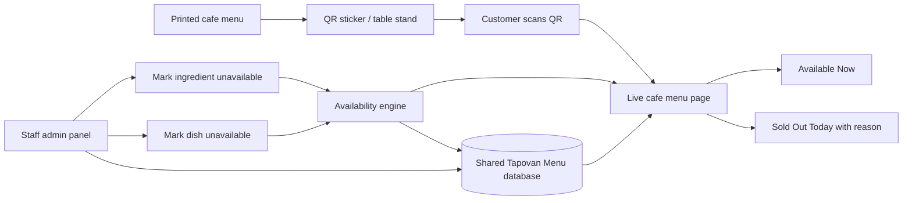
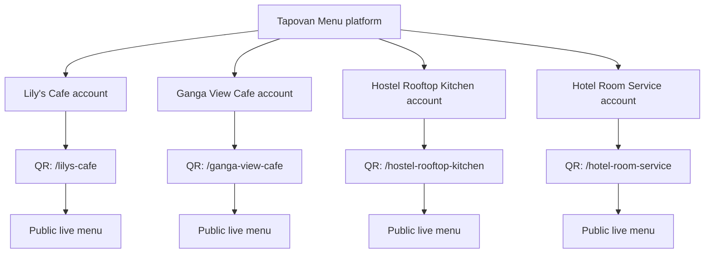
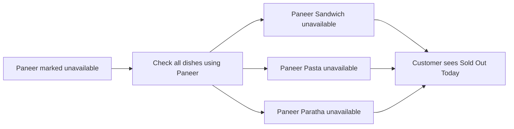

# Tapovan Menu Flow Diagram

## Customer and admin flow

```mermaid
flowchart LR
    A[Printed cafe menu] --> B[QR sticker / table stand]
    B --> C[Customer scans QR]
    C --> D[Live cafe menu page]
    D --> E[Available Now]
    D --> F[Sold Out Today with reason]

    G[Staff admin panel] --> H[Mark ingredient unavailable]
    G --> I[Mark dish unavailable]
    H --> J[Availability engine]
    I --> J
    J --> D

    K[(Shared Tapovan Menu database)] --> D
    G --> K
    J --> K
```

## Multi-cafe platform model

```mermaid
flowchart TB
    P[Tapovan Menu platform] --> C1[Lily's Cafe account]
    P --> C2[Ganga View Cafe account]
    P --> C3[Hostel Rooftop Kitchen account]
    P --> C4[Hotel Room Service account]

    C1 --> Q1[QR: /lilys-cafe]
    C2 --> Q2[QR: /ganga-view-cafe]
    C3 --> Q3[QR: /hostel-rooftop-kitchen]
    C4 --> Q4[QR: /hotel-room-service]

    Q1 --> M1[Public live menu]
    Q2 --> M2[Public live menu]
    Q3 --> M3[Public live menu]
    Q4 --> M4[Public live menu]
```

## Availability rule

```mermaid
flowchart LR
    A[Paneer marked unavailable] --> B[Check all dishes using Paneer]
    B --> C[Paneer Sandwich unavailable]
    B --> D[Paneer Pasta unavailable]
    B --> E[Paneer Paratha unavailable]
    C --> F[Customer sees Sold Out Today]
    D --> F
    E --> F
```
